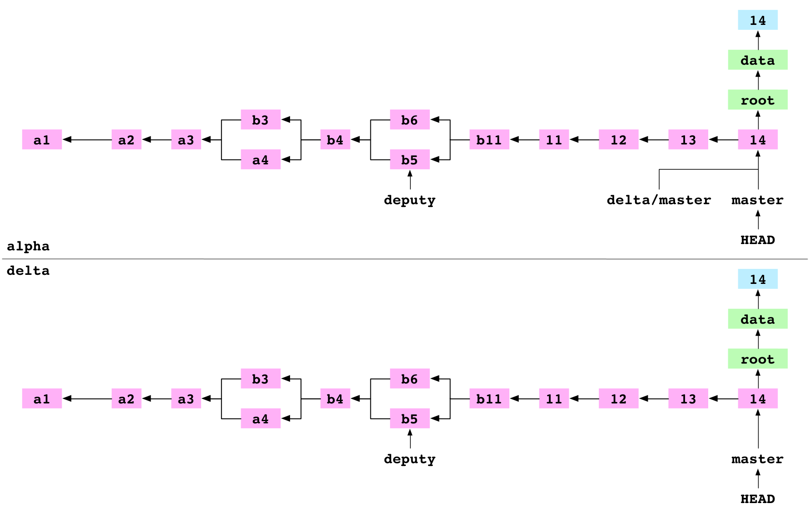

# Advanvced Git

*Saez Computational Club (13 March 2023)*

---

## Know the very basics of how git works

https://maryrosecook.com/blog/post/git-from-the-inside-out



---

## Mind your commit messages

- Not useful: `Updated boxplots.R`
- More useful: `boxplots: darker whiskers`
- Use labels
- Trigger GitHub functionalities

---

## Don't you know what you're about to commit?

```
git status
git diff
```

---

## Not all recent work must go into one commit

```
git add R/misc.R
git commit -m 'generic function to add version info to plots'
git add R/boxplots.R
git commit -m 'moved boxplots to facet grid'
git add R/workflow.R
git commit -m 'workflow: boxplots also for activities'
```

Sort chunks within files:

```
git add -p R/plots.R
```

---

## Stash your changes until you work on something else

```
git diff HEAD
git stash
git checkout dev
# ... do something on dev
git stash pop
```

---

## Cherry picking

```
git branch --show
# master
git add R/models.R
git commit -m 'fixed model calculations broken due to library update'
[master 53eeec6] fixed model calculations broken due to library update'
 1 file changed, 7 insertion(+), 5 deletion(-)
git checkout RELEASE_3_16
git cherry-pick 53eeec6
git push bioc RELEASE_3_16
git push saez RELEASE_3_16
git push bioc master
git push saez master
git checkout master
```

```
git add -u
git cherry-pick --continue
```

```
git cherry-pick --abort
```

---

## Modify commits

```
git add -u
git commit --amend -m 'better proportions for plots'
```

```
git add -u
git rebase -i 53eeec6^
# then you do your new changes
git add -u
git commit --amend -m 'better proportions for plots'
```

---

## Merge multiple commits into one

```
git rebase -i a788fe9  # refer to the oldest commit in the sequence
```

```
git add -u
git commit --squash -m 'created data frame output'
git add -u
git commit --squash -m 'updated data frame column layout'
git add -u
git commit --squash -m 'fixed data frame dtypes'
git rebase -u --autosquash
```

---

## Branches

Easy switching:

```
git branch -
```

Insights:

```
git branch -vv
```

---

## Merge old stuff

With `git rebase`:

- Check out an old state
- Merge the branch or commit or patch
- Rebase the branch onto the new merge commit

```
git checkout a788fe9
git apply some-old-patch.patch
git add -u
git rebase master
# resolve conflicts
git add -u
git rebase --continue
```

---

## Revert undesired changes or commits

```
echo 'something' > foobar
git add foobar
git commit -m 'test commit, to be removed'
git log
git reset --soft @~1
git status
git reset --hard @
git status
ls foobar  # it's gone!
```

---

## Undo changes but keep them in history

```
git revert bfb994a  # refer to the commit that you want to undo
```

---

## Apropos: what are those magic characters?

`@` simply means `HEAD`; about the tilde and caret:

- `HEAD~2`: 2 steps back from `HEAD`
- `HEAD^2`: the second parent of `HEAD`, if `HEAD` is a merge
- `HEAD^2~3`: 3 steps back from the 2nd parent (also if `HEAD` is a merge)
- `HEAD@{2}`: 3 steps back in `reflog`
- `HEAD~~` or `HEAD^^`: 2 commits older than `HEAD`

Check out `git help revisions`, it has a cool figure about these.

---

## Fast clone: ignore the history

```
git clone --depth 1 https://github.com/saezlab/OmnipathR
cd OmnipathR
git log  # see the history: it's only of length 1
```

---

## Check out a pull request locally

```
git fetch origin pull/17/head:pr17
git checkout pr17
# do your work
# then merge and push:
git checkout master
git merge pr17
git push origin master
# or push it to the PR, without merge:
git remote add colleague https://github.com/colleague/repo.git
# note: local branch "pr17" is pushed to "master" of the "colleague" remote
git push pr17 colleague:master
```

```
git config --global alias.pr '!sh -c '"'"'git fetch $1 pull/$2/head:pr$2 && git checkout pr$2'"'"' -'
```

---

## Hooks

```
echo "cowsay 'hello, thanks for the commit!'" >> .git/hooks/pre-commit
chmod +x .git/hooks/pre-commit
echo 'foo' > bar
git add bar
git commit -m 'test commit, to be removed'
git reset HEAD~1
```

---

## Pretty logs

```
git log --oneline
git log --graph --oneline
git log --graph --pretty=format:'%Cred%h%Creset -%C(yellow)%d%Creset %s %Cgreen(%cr) %C(bold blue)<%an>%Creset' --abbrev-commit --date=relative
```

```
git config --global alias.lol "log --graph --pretty=format:'%Cred%h%Creset -%C(yellow)%d%Creset %s %Cgreen(%cr) %C(bold blue)<%an>%Creset' --abbrev-commit --date=relative"
```

---

## The `reflog`

```
git reflog
```

---

## More info about the repo

Some more useful insights: first, total number of commits:

```
git rev-list --all --count
git rev-list --count master  # only on master
```

Number of lines changed since a certain point:

```
git diff --stat 7a4f9dd HEAD  # since that commit
git diff --shortstat @~3 @  # last 3 commits
git diff --cached --shortstat @~3 @  # include uncommitted changes
git diff --shortstat '@{10 days ago}'  # last 10 days
```

---

Commits from a particular author:

```
git log --author=deeenes
```

Lines changed by a particular author (yes, git can't add those numbers):

```
git log --since=2023-01-01 --until='{@ today}' --author=deeenes --format= --numstat | awk '{s+=$1; s+=$2} END {print s}'
```

---

## Who wrote this line?

```
git blame path/to/file
```

---

## Info about the remotes

```
git status
git remote show origin
```

---

## Use `.gitignore`

- Always include API tokens, passwords, etc.
- Global `~/.gitignore` for `.DS_Store` and friends

---

## Remove without delete

```
git rm --cached large.pdf
```

---

## Modify the history

```
git filter-branch --index-filter 'git rm --cached --ignore-unmatch file/to/be/removed' --prune-empty --tag-name-filter cat -- --all
```

---

## Reduce repo size

```
git rev-list --all | xargs -rL1 git ls-tree -r --long | sort -uk3 | sort -rnk4
```

Or with some more insight:

```
du -sh .git/objects/pack/* | sort -hr
git ls-tree -r --long 992d7fe134e5405e7e55c8730c0c709c776d28a5 | sort -rnk4
```

---

Another option to reduce the repo size is to remove stale branches.

```
git remote prune origin --dry-run
git remote prune origin
```

Set config to automatically do this:

```
git config --global fetch.prune true
```

```
git gc --aggressive --prune=now
```

---

## Archiving and offline sharing

```
git archive --format=tar.gz master > master.tar.gz
```

```
git bundle crate backup-20230313.bundle master
# restore the repo (to the "newrepo" directory):
git bundle unbundle backup-20230313.bundle master newrepo
```

---

## Collect and remove untracked files

```
git ls-files --others --exclude-standard -z | xargs -0 tar -rzvf repo-junk.tar.gz
git clean -fdn
git clean -fd
```

Be careful with `git clean`!

---

## Git is keen to help you!

```
git reset --help
```

And even beyond that, it has a whole manual book full of useful topics:

```
git help -g
git help -a
git help tutorial
```
